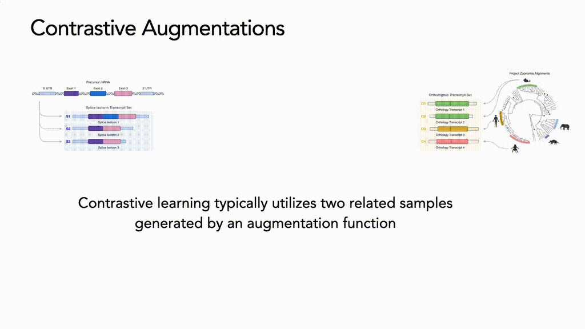

<div align="center">

# Orthrus: Towards Evolutionary and Functional RNA Foundation Models

[](https://philechka.com/science/orthrus)
[](https://www.biorxiv.org/content/10.1101/2024.10.10.617658v1)
[](https://huggingface.co/antichronology/orthrus/blob/main/README.md)
[](https://doi.org/10.5281/zenodo.13910050)
[](https://github.com/bowang-lab/Orthrus/blob/main/LICENSE.md)

[](https://www.python.org/downloads/release/python-3100/)
[](https://pytorch.org/get-started/locally/)
[](https://pytorchlightning.ai/)

<div align="center">


<p align="center">
  
</p>

<div align="left">

## Model Overview

<div style="display: flex; align-items: flex-start;">
<div style="flex: 1;">

Orthrus is a mature RNA model for RNA property prediction. It uses a Mamba encoder backbone, a variant of state-space models specifically designed for long-sequence data, such as RNA. 

Two versions of Orthrus are available:

- 4-track base version: Encodes the mRNA sequence with a simplified one-hot approach.
- 6-track large version: Adds biological context by including splice site indicators and coding sequence markers, which is crucial for accurate mRNA property prediction such as RNA half-life, ribosome load, and exon junction detection.

**Why the Mamba Backbone?**
The Mamba architecture is an extension of the S4 (structured state-space) model family, which excels at handling long sequences like mRNAs that can reach over 12,000 nucleotides. This makes it an ideal fit for RNA property prediction models for several reasons:

- _Efficient Memory Usage:_ Unlike transformers, which require quadratic memory scaling with sequence length, the Mamba backbone scales linearly, making it computationally efficient for long sequences.
- _Variable Context Filtering:_ RNA sequences often contain functionally relevant motifs separated by variable spacing. The Mamba model is capable of selectively focusing on these important elements
- _Selective Context Compression:_ Genomic sequences often have uneven information density, with critical regulatory elements scattered across regions of varying importance. The Mamba model selectively compresses less informative regions while preserving the context of key functional areas

<div style="text-align: center;">
  
</div>

## Using Orthrus

Orthrus was trained on full RNA sequences, making its usage different from models like DNABERT or Enformer, which focus on arbitrary DNA segments. 
Orthrus was instead trained on full mature RNA sequences so if you pass an incomplete piece of a spliced RNA the input sample will be out of distribution. 

To generate embeddings using Orthrus for spliced mature RNA sequences, follow the steps below:

### Create and Set Up the Environment

We recommend using Mamba (a faster alternative to Conda) for environment creation, but Conda works as well. Follow these steps to set up your environment:

1. Install Mamba or Conda if you haven't already.

2. Create and activate the environment:
```bash
# Create the environment from the provided YAML file
mamba env create -f env.yml
# Activate the environment
conda activate orthrus
```

3. Install additional dependencies:
```bash
# Install necessary dependencies for the Mamba model (not the environment manager)
pip install causal_conv1d==1.1.1
pip install mamba-ssm==1.2.0.post1 --no-cache-dir
```

4. Set up GenomeKit:
```bash
# Download the GenomeKit setup script
wget -O starter_build.sh https://raw.githubusercontent.com/deepgenomics/GenomeKit/main/starter/build.sh
# Make the script executable
chmod +x starter_build.sh
# Run the script to download genomes and annotations
./starter_build.sh
```

5. Install orthrus package so you can perform import
```bash
pip install -e .
```

Now you're ready to use Orthrus for generating embeddings!

### Generating Embeddings

#### 4-Track Model

The 4-track model requires only a one-hot encoded sequence of your mRNA. This representation captures the basic nucleotide information of the mRNA sequence.

Here is example code
```
# Sequence for short mRNA
> seq=(
'TCATCTGGATTATACATATTTCGCAATGAAAGAGAGGAAGAAAAGGAAGCAGCAAAATATGTGGAGGCCCA'
 'ACAAAAGAGACTAGAAGCCTTATTCACTAAAATTCAGGAGGAATTTGAAGAACATGAAGTTACTTCCTCC'
 'ACTGAAGTCTTGAACCCCCCAAAGTCATCCATGAGGGTTGGAATCAACTTCTGAAAACACAACAAAACCA'
 'TATTTACCATCACGTGCACTAACAAGACAGCAAGTTCGTGCTTTGCAAGATGGTGCAGAGCTTTATGAAG'
 'CAGTGAAGAATGCAGCAGACCCAGCTTACCTTGAGGGTTATTTCAGTGAAGAGCAGTTAAGAGCCTTGAA'
 'TAATCACAGGCAAATGTTGAATGATAAGAAACAAGCTCAGATCCAGTTGGAAATTAGGAAGGCCATGGAA'
 'TCTGCTGAACAAAAGGAACAAGGTTTATCAAGGGATGTCACAACCGTGTGGAAGTTGCGTATTGTAAGCTATTC'
)
# One hot encode function
> oh = seq_to_oh(seq)
> one_hot = seq_to_oh(seq)
> one_hot = one_hot.T
> torch_one_hot = torch.tensor(one_hot, dtype=torch.float32)
> torch_one_hot = torch_one_hot.unsqueeze(0)
> print(torch_one_hot.shape)
> torch_one_hot = torch_one_hot.to(device='cuda')
> lengths = torch.tensor([torch_one_hot.shape[2]]).to(device='cuda')
# Load Orthrus
> run_name="orthrus_base_4_track"
> checkpoint="epoch=18-step=20000.ckpt"
> model_repository="./models"
> model = load_model(f"{model_repository}{run_name}", checkpoint_name=checkpoint)
> model = model.to(torch.device('cuda'))
> print(model)
# Generate embedding
> reps = model.representation(torch_one_hot, lengths)
> print(reps.shape)
# torch.Size([1, 256])
```

#### 6-Track Model (Recommended)
The 6-track model offers a more detailed representation by incorporating additional biological context, including splice site and coding sequence information. To generate embeddings for this model:

We're going to be using an awesome library called GenomeKit to extract DNA sequences and build 4/6 track representations of mRNA transcripts, which will be used as input for Orthrus. GenomeKit makes it easy to work with genomic data, such as sequences and annotations, by providing tools to access and manipulate reference genomes and variants efficiently. It's built by the awesome folks at Deep Genomics

For more details, you can refer to the [GenomeKit documentation](https://deepgenomics.github.io/GenomeKit/api.html).

To install it:
```
mamba install "genomekit>=6.0.0"
# we now want to download the genome annotations and the 2bit genome files
wget -O starter_build.sh https://raw.githubusercontent.com/deepgenomics/GenomeKit/main/starter/build.sh
chmod +x starter_build.sh
./starter_build.sh
```

We can now generate six track encodings for any transcript!
```
# import Genome, Interval, instantiate Genome
> genome = Genome("gencode.v29")
> interval = Interval("chr7", "+", 117120016, 117120201, genome)
> genome.dna(interval)
# CTCTTATGCTCGGGTGATCC

# Load Orthrus 6 track
> run_name="orthrus_large_6_track"
> checkpoint="epoch=22-step=20000.ckpt"
> model_repository="./models"
> model = load_model(f"{model_repository}{run_name}", checkpoint_name=checkpoint)
> model = model.to(torch.device('cuda'))
> print(model)
# Generate embedding
> transcripts = find_transcript_by_gene_name(genome, 'BCL2L1')
> print(transcripts)
> t = transcripts[0]
> sixt = create_six_track_encoding(t)
> sixt = torch.tensor(sixt, dtype=torch.float32)
> sixt = sixt.unsqueeze(0)
> sixt = sixt.to(device='cuda')
> lengths = torch.tensor([sixt.shape[2]]).to(device='cuda')
> embedding = model.representation(sixt, lengths)
> print(embedding.shape)
# torch.Size([1, 512])
```

Alternatively, this information can be extracted from genePred files available for download from the UCSC Genome Browser [here](https://genome.ucsc.edu/cgi-bin/hgTables).


### Fine-Tuning Orthrus

All the data for fine tuning, linear probing, and homology splitting is available at this zenodo link: https://zenodo.org/records/13910050 

To fine tune orthrus you can use the pre-specified configurations lockated in `./orthrus/rna_task_config` for data, model, optimizer, projector, and training parameters. Here is an example command that will fine tune Orthrus on an RNA half-life dataset:

cd orthrus 

```bash
python rna_task_train.py \
--model_config mamba_pre_base \
--train_config bs_64_short_run \
--projector_config default_256 \
--data_config rna_hl \
--optimizer_config no_wd_1e-3 \
--seed_override 0 
```

Before running the command please remember to update your data storage directory and your model weights directory in configs.

If you're interested in running data ablation experiments simply use one of the configured data configurations in `./orthrus/rna_task_config` or create a new one. Here is an example of fine tuning GO classification with 10 percent of the data.

```bash
python rna_task_train.py \
--model_config mamba_pre_base \
--train_config bs_64_1000_steps \
--projector_config default_256_go \
--data_config go_mf_dataset_10pct \
--optimizer_config no_wd_1e-3_100_warmup \
--seed_override 0 
```

### Linear Probing

Similarly for linear probing:

```bash
python linear_probe_eval.py \
--run_name orthrus_large_6_track \
--model_name="epoch=22-step=20000.ckpt" \
--model_repository="/scratch/hdd001/home/phil/msk_backup/runs/" \
--npz_dir="/fs01/home/phil/Documents/01_projects/rna_rep/linear_probe_data2" \
--verbose 1 \
--n_seeds 1 \
--n_tracks 6 \
--load_state_dict=true \
--full_eval \
--homology_split=true 
```

```
@article{orthrus_fradkin_shi_2024,
  title = {Orthrus: Towards Evolutionary and Functional RNA Foundation Models},
  url = {http://dx.doi.org/10.1101/2024.10.10.617658},
  DOI = {10.1101/2024.10.10.617658},
  publisher = {Cold Spring Harbor Laboratory},
  author = {Fradkin,  Philip and Shi,  Ruian and Isaev,  Keren and Frey,  Brendan J and Morris,  Quaid and Lee,  Leo J and Wang,  Bo},
  year = {2024},
  month = oct 
}
```
